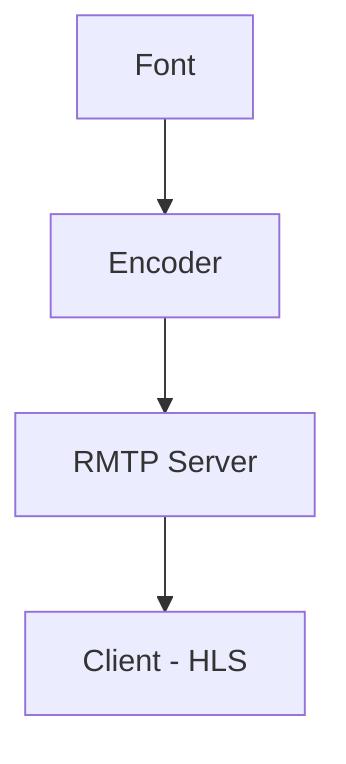

# RTMP SERVER 

A simple live video streaming service using nginx, rtmp, hls and golang (for authentication service).

 

### What's RTMP ?

 

RTMP (Real-time messaging protocol) is a data transmission technology developed by Macromidia, initially dedicated to transmitting data between streaming servers and the old Adobe Flash Player.

Nowadays the RTMP protocol is constantly used by services such as Facebook, Twitter, and Twitch to deliver live video to their users. 

In RTMP the content is delivered in chunks, usually called "chunks", so the user can consume the content without having to wait for the complete download.

 

### How a RTMP transmission works?

 

